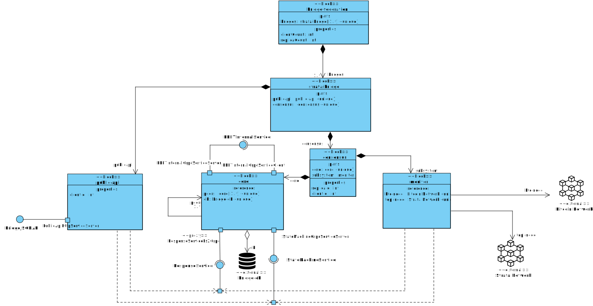

# Federation Architecture

## Block Diagram

The following diagram shows the architecture of the federation system:

 

## Components

### brdge-federation

The bridge federation it self is composed by a set of one or more `strata-bridge`
nodes. It has also two properties: `clientCount` and `replicaCount`. The `clientCount`
is the number of clients that can connect to the federation. The `replicaCount` is the
number of replicas that the federation has.

### strata-bridge

The `strata-bridge` is a node that is part of the federation. It is responsible for
reaching consensus on the state of the federation. It is composed by the following:

- **consensus**: This is a subsystem that run autonomously and is responsible for
  reaching consensus on the state of the federation using the PBFT algorithm.
- **public-api**: This is a subsystem that is responsible for handling requests from
  the clients and interacting with the consensus layer.

### public-api

The public API is a client to the consensus layer. It exposes a REST API `BridgeJSONAPI` to the users.
It is a PBFT client. It knows all the replicas and interacts with them according
to the PBFT protocol.

As a standard client, it exposes a `ResponseService` that is responsible for handling
the responses from the replicas. 

### consensus

The consensus layer has two parts:

- **core**: This package contains the PBFT consensus algorithm. It is responsible for
  reaching consensus on the state of the federation.
- **subsystems**: This package contains the monitoring subsystem. It is responsible for
  monitoring the blockchain and updating the state of the federation.

It has assigned a `replicaId` that is used to identify the replica in the federation,
and a `clientId` that is used to identify the `monitor` in the federation as
another normal client.

### core

The core package has access to an external database that is used to store the
PBFT log. It is responsible for reaching consensus, and manages also
the state of the node. If has a PBFT client to respond to the requests from the
`public-api` and the `monitor`.	

This system also offers a `StateMachineGrpcServiceServer` that is responsible for
handling the requests from the `public-api` and the `monitor` to update the state
of the state machine.

The state machine service is provided by the `StateMachineService` interface.

### monitor

The monitor is a client that is responsible for monitoring the blockchain and updating
the state of the federation. It is a PBFT client. It knows all the replicas and interacts
with them according to the PBFT protocol.

It also knows the Bitcoin network and the Strata network. It monitors them,
changes its state accordingly and then updates the state of the federation
via the `StateMachineService` interface.