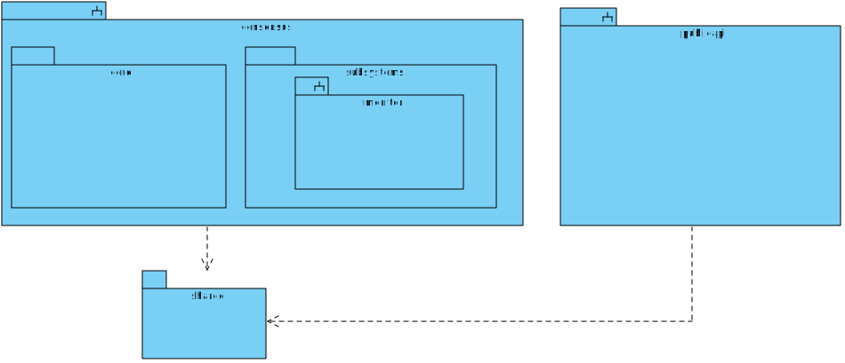

# Repository Layout

## Package Diagram

The following diagram shows repository layout of the bridge:

 

The repository contains three sub-projects:

- **consensus**: This project contains the consensus layer of the bridge. It is responsible for the consensus algorithm and monitoring the blockchain.
- **public-api**: This project contains the public API of the bridge. It is responsible for handling requests from the users and interacting with the consensus layer.
- **shared**: This project contains the shared code between the consensus and public-api projects.

### Consensus 

The consensus layer is divided in two packages:

- **core**: This package contains the PBFT consensus algorithm. It is responsible for reaching consensus on the state of the bridge.
- **subsystems**: This package contains the monitoring subsystem. It is responsible for monitoring the blockchain and updating the state of the bridge.

### Public API

The public API is a client to the consensus layer. It exposes a REST API to the users. It
is a PBFT client. It knows all the replicas and interacts with them according
to the PBFT protocol.