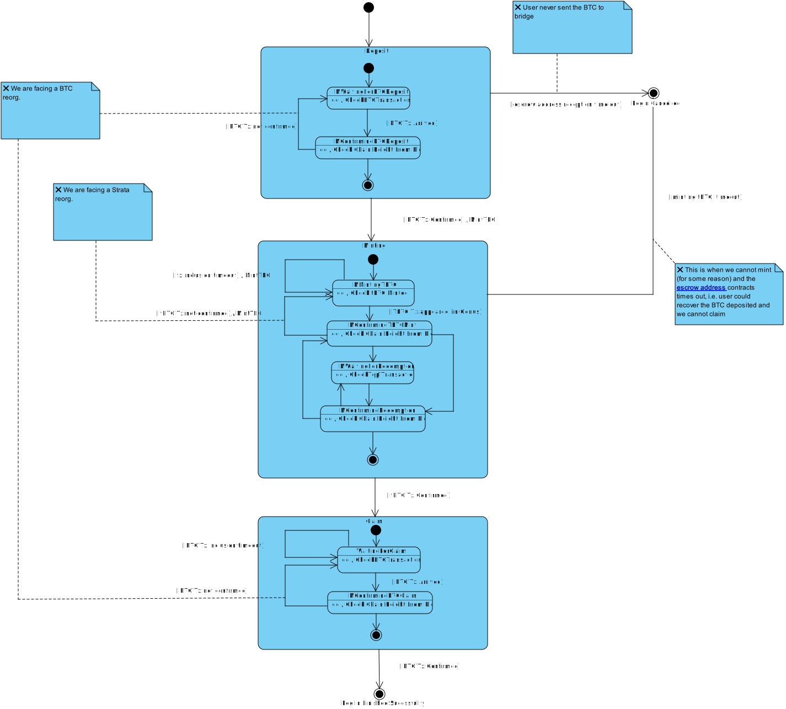

# Monitor State Machine

## State Machine Diagram

The following diagram shows repository layout of the bridge:

 

## States

The monitor has the following states:

- **MWaitingForBTCDeposit**: The monitor is waiting for a deposit of BTC to the escrow address.
- **MConfirmingBTCDeposit**: The monitor is confirming the deposit of BTC to the escrow address.
- **MMintingTBTC**: The monitor is minting tBTC.
- **MConfirmingTBTCMint**: The monitor is confirming the mint of tBTC.
- **MWaitingForRedemption**: The monitor is waiting for a redemption of tBTC.
- **MConfirmingRedemption**: The monitor is confirming the redemption of tBTC.
- **WaitingForClaim**: The monitor is waiting for a claim of the BTC.
- **MConfirmingBTCClaim**: The monitor is confirming the claim.